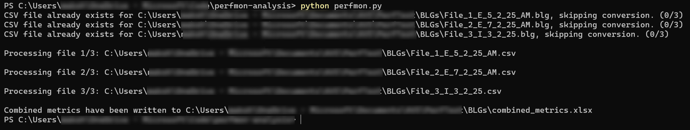

# Perfmon (.blg) File Analyzer

Performance testing involves execution of multiple runs. These runs spans multiple days/weeks. [perfmon](https://learn.microsoft.com/en-us/windows-server/administration/windows-commands/perfmon) is a widely used tool for gathering diagnostic data during performance testing on Windows servers. perfmon captures data from a pefromance test which can be exported as `.blg` file for further analysis. If there are multiple teams involved in performance testing exercise then sharing these `.blg` files can enable every team member to analyze them independently. Perfmon File Analyzer helps in simplifying this experience further as discussed below.

## Challenges with perfmon file analysis

As mentioned earlier, performance testing activity typically spans multiple days/weeks. Teams involved in performance testing encounter following challenges.

1. *perfmon file sprwal*: As the number of performance test runs increase, there is related growth in number of perfom files. If there are multiple servers on which diagnostic data is captured through perfmon then growth in perfmon files is multipled by those many servers. Such a performance testing activity can quickly result in huge number of perfmon files to be analyzed.

2. *Comparison*: While each perfmon file captures daignostic data for a specific run, it is necessary to compare them across multiple runs. As part of performnce testing, teams typically tweak a confifuration or code and run the test again. Such mode of operation involves comparing and contrasting diagnostics data across multiple runs. It quickly becomes challenging to compare multiple perfmon files across multiple runs and servers being profiled.

3. *Sharing*: perfmon files are an excellent tool for technical team to get a deeper look inside multiple counters during a performance testing run. Graphical representation of counter values against time can help in identifying patterns as well as anamolies. However, these can be shared as screenshots or pictures. Sharing of patterns, anamolies over multiple runs becomes even more challneging - espacially to non-technical stakeholders.

## How does Perfmon File Analyzer help?

Perfmon File Analyzer addresses the challenges discussed above. It is a utility which processes raw perfmon `.blg` files and simplifies their processing as discussed below.

1. *analyses multiple files at once*: Perfmon File Analyzer can work with a single or multiple perfmon `.blg` files. This enables  performance teams to get rid of having to manage each file individually. Regardless of number of perfmon `.blg` files, performance teams can focus on core task of pattern, anamoly detection, etc. as opposed to having to manage and analyse individual file.

2. *Easy comparison*: Output obtained after running Perfmon File Analyzer is easy row/column comparison in Excel. This enables performance teams to compare and contrast multiple perfmon files easily without having to switch between them. In-built Filtering/Sorting functionality withing Excel can enable them to focus on specific counters and specific runs. Such comparison helps is identifying trend across multiple tests.

3. *Easy sharing*: Perfmon File Analyzer generates an Excel file as its output. This enables easy sharing of consolidated data instead of sharing screenshots or pictures. Because performance test output is consolidated in a single place from multiple days or servers, any discussion becomes very productive. Non-technical stakeholders can also have access to holistic view of multiple performance tests.

## Perfmon File Analyzer high-level design

Following flowchart describes high-level overview of how Perfmon File Analyzer works.

flowchart TD
    A[Start] --> B[Convert .blg to .csv]
    B --> C[Extract PerfMon Data]
    C --> D[Initialize Perfmon Counter/metric List]
    D --> E[Find Logical end of the test]
    E --> F{Logical end Found?}
    F -->|Yes| G[Calculate statistics for baseline metric]
    F -->|No| H[Skip to Next File]
    G --> I[Calculate statistics for all other metrics]
    I --> J[Increment File Counter]
    J --> K{All Files Processed?}
    K -->|Yes| L[Consolidate statistics]
    L --> M[Organize & Process statistics]
    M --> N[Write to Excel]
    N --> O[End]

Each of the step is described below.

* Convert .blg to .csv
    * This step converts `.blg` file to `.csv` file using windows `relog` utility. If there are multiple `.blg` files in a specific directory then all the files are converted into `.csv` files.

* Extract PerfMon Data
    * This step reads all the data from CSV file

* Initialize Perfmon counter/metric List
    * In this step, users can specify which specific perfmon counter/metrics they are interested in. A typicall perfmon `.blg` file contains multiple counters across multiple objects. This results in huge number of metrics which can be confusing for meanigful analysis. This step enables users to focus only on specific counters/metrics.

* Find Logical end of the test
    * Many time performance tests run for hours. Even when test is finsihed, perfmon profiling still continues to run. This can affect counter values - specifically average - because overall time-range is high. This step ensures that data from meaningful time range is captured as opposed to total time range.

* Calculate statistics for baseline metric
    * Baseline metric is a leading metric. `Request Execution Time` can be a baseline metric for `ASP.Net Application`. This is the metric against which other metrics are compared.

* Calculate statistics for all other metrics
    * This step calculates the statistics (avg. max.) against all the metrics defined in counter/metric list.

* Consolidate statistics
    * This step structures the values of each metrics from multiple `.blg` files.

* Organize & Process statistics
    * This step converts values to numeric data as well as rounding them.

* Write to Excel
    * This step creates final Excel report in the same location where all `.blg` files are kept.

## Prerequisites

Ensure that following prerequisites are in place before getting started with Perfmon File Analyzer.

1. Keep all the `.blg` files in a single folder. This folder will be used to keep corresponding `.csv` files. Same folder will also store final Excel report - `combined_metrics.xlsx`.
2. Assign the value of variable `log_directory` in the `perfmon.py`.
3. Assign value for baseline metric in variable `baseline_metric_name` in the `perfmon.py`.
4. Define the list of metrics you want to track in final report using variable `metric_names` in the `perfmon.py`.
5. Download and install Python. On Winodows Desktop, this can be done using [Windows Store](https://apps.microsoft.com/detail/9pjpw5ldxlz5?hl=en-US&gl=US).

## Deployment Steps

1. Clone this repository.
2. Navigate to cloned folder.
3. Install module `openpyxl` by running `pip install openpyxl`
4. Open windows terminal in either command prompt or powershell prompt.
5. Run `python perfmon.py`. You should see output as below.
   
6. Alternatively, use Python Extension in VS Code to run the `perfmon.py`.

## Post-deployment Steps

* Navigate to the Excel file generated.It should look like as below.

    

* Format the data as appropriate. Notice that each column header has information as below.
    * Date: This is the date as cpatured in perfmon `.blg` file.
    * Server Name: This is the server on which perfmon captured the diagnostic data.
    * Statistics: There are two columns. One for Average value and another for Maximum value for each counter.
    * Time: This represents the time interval considered for capturing the diagnostic data for each file.  
