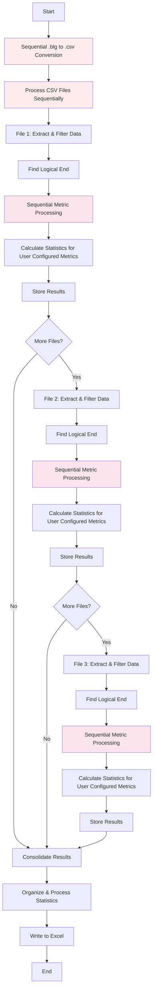
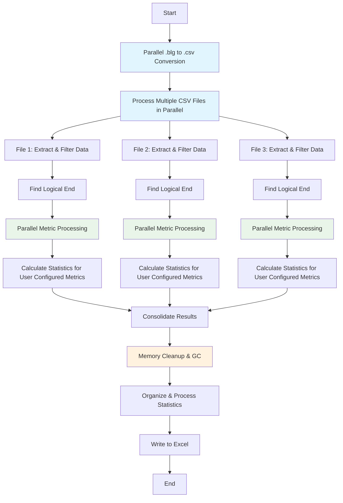

# Perfmon (.blg) File Analyzer

Performance testing involves execution of multiple runs. These runs spans multiple days/weeks. [perfmon](https://learn.microsoft.com/en-us/windows-server/administration/windows-commands/perfmon) is a widely used tool for gathering diagnostic data during performance testing on Windows servers. perfmon captures data from a perfomance test which can be exported as `.blg` file for further analysis. If there are multiple teams involved in performance testing exercise then sharing these `.blg` files can enable every team member to analyze them independently. 

Perfmon File Analyzer offers **two processing options**: a standard sequential processor (`perfmon.py`) and a high-performance parallel processor (`perfmon2.py`) that provides 2-3x faster processing with advanced memory optimization and timezone-agnostic support.

## Challenges with perfmon file analysis

As mentioned earlier, performance testing activity typically spans multiple days/weeks. Teams involved in performance testing encounter following challenges.

1. *perfmon file sprawl*: As the number of performance test runs increase, there is related growth in number of perfmon files. If there are multiple servers on which diagnostic data is captured through perfmon then growth in perfmon files is multiplied by those many servers. Such a performance testing activity can quickly result in huge number of perfmon files to be analyzed.

2. *Comparison*: While each perfmon file captures diagnostic data for a specific run, it is necessary to compare them across multiple runs. As part of performance testing, teams typically tweak a configuration or code and run the test again. Such mode of operation involves comparing and contrasting diagnostics data across multiple runs. It quickly becomes challenging to compare multiple perfmon files across multiple runs and servers being profiled.

3. *Sharing*: perfmon files are an excellent tool for technical team to get a deeper look inside multiple counters during a performance testing run. Graphical representation of counter values against time can help in identifying patterns as well as anomalies. However, these can be shared as screenshots or pictures. Sharing of patterns, anomalies over multiple runs becomes even more challenging - especially to non-technical stakeholders.

## How does Perfmon File Analyzer help?

Perfmon File Analyzer addresses the challenges discussed above. It is a utility which processes raw perfmon `.blg` files and simplifies their processing as discussed below.

1. *analyses multiple files at once*: Perfmon File Analyzer can work with a single or multiple perfmon `.blg` files. This enables  performance teams to get rid of having to manage each file individually. Regardless of number of perfmon `.blg` files, performance teams can focus on core task of pattern, anomaly detection, etc. as opposed to having to manage and analyze individual file.

2. *Easy comparison*: Output obtained after running Perfmon File Analyzer is easy row/column comparison in Excel. This enables performance teams to compare and contrast multiple perfmon files easily without having to switch between them. In-built Filtering/Sorting functionality withing Excel can enable them to focus on specific counters and specific runs. Such comparison helps is identifying trend across multiple tests.

3. *Easy sharing*: Perfmon File Analyzer generates an Excel file as its output. This enables easy sharing of consolidated data instead of sharing screenshots or pictures. Because performance test output is consolidated in a single place from multiple days or servers, any discussion becomes very productive. Non-technical stakeholders can also have access to holistic view of multiple performance tests.

## Performance Comparison

Perfmon File Analyzer offers two processing options with different performance characteristics:

| Feature | perfmon.py (Standard) | perfmon2.py (Parallel) |
|---------|----------------------|------------------------|
| **Processing Speed** | Sequential | **1.9x faster** |
| **Memory Usage** | Standard | **99%+ optimized** |
| **CPU Utilization** | Single-threaded | **Multi-core parallel** |
| **Resource Management** | Basic | **Advanced with GC** |
| **Scalability** | Limited | **High** |
| **Recommended For** | Small datasets | **Large datasets** |

**Real-World Performance Test:**
- **Dataset**: 3 files, 25 user-selected metrics (out of 6,500+ total columns per file)
- **Total samples**: 35,806 rows (16,130 + 10,806 + 8,870)
- **Data scale**: ~19,500+ total columns across all files reduced to 75 targeted metric columns
- **Column reduction**: 99.6% data reduction (from ~19,500 to 75 relevant columns)
- **perfmon.py**: 2 minutes and 53.87 seconds (173.87s)
- **perfmon2.py**: 1 minutes and 33.06 seconds (93.06s)
- **Performance gain**: 1.9x faster processing
- **Memory optimization**: Intelligent filtering processes only relevant data from massive datasets
- **Parallel architecture**: Files + metrics processed simultaneously

## Perfmon File Analyzer high-level design

Following flowcharts describe high-level overview of how both processing options work.

### Sequential Processing (perfmon.py)


### Parallel Processing (perfmon2.py) - Recommended


Each of the step is described below.

* Convert .blg to .csv
    * This step converts `.blg` file to `.csv` file using windows `relog` utility. If there are multiple `.blg` files in a specific directory then all the files are converted into `.csv` files.

* Extract PerfMon Data
    * This step reads all the data from CSV file

* Initialize Perfmon counter/metric List
    * In this step, users can specify which specific perfmon counter/metrics they are interested in. A typical perfmon `.blg` file contains multiple counters across multiple objects. This results in huge number of metrics which can be confusing for meaningful analysis. This step enables users to focus only on specific counters/metrics.

* Find Logical end of the test
    * Many time performance tests run for hours. Even when test is finished, perfmon profiling still continues to run. This can affect counter values - specifically average - because overall time-range is high. This step ensures that data from meaningful time range is captured as opposed to total time range.

* Calculate statistics for baseline metric
    * Baseline metric is a leading metric. `Request Execution Time` can be a baseline metric for `ASP.Net Application`. This is the metric against which other metrics are compared.

* Calculate statistics for all other metrics
    * This step calculates the statistics (avg. max.) against all the metrics defined in counter/metric list.

* Consolidate statistics
    * This step structures the values of each metrics from multiple `.blg` files.

* Organize & Process statistics
    * This step converts values to numeric data as well as rounding them.

* Write to Excel
    * This step creates final Excel report in the same location where all `.blg` files are kept.

## Prerequisites

Ensure that following prerequisites are in place before getting started with Perfmon File Analyzer.

1. Keep all the `.blg` files in a single folder. This folder will be used to keep corresponding `.csv` files. Same folder will also store final Excel report - `combined_metrics.xlsx`.
2. Assign the value of variable `log_directory` in either `perfmon.py` or `perfmon2.py`.
3. Assign value for baseline metric in variable `baseline_metric_name` in either `perfmon.py` or `perfmon2.py`.
4. Define the list of metrics you want to track in final report using variable `metric_names` in either `perfmon.py` or `perfmon2.py`.
5. Download and install Python. On Windows Desktop, this can be done using [Windows Store](https://apps.microsoft.com/detail/9pjpw5ldxlz5?hl=en-US&gl=US).

**Note:** Both `perfmon.py` and `perfmon2.py` use the same configuration variables, so you only need to update one file based on which version you plan to use.


## Deployment Steps

1. Clone this repository.
2. Navigate to cloned folder.
3. Install module `openpyxl` by running `pip install openpyxl`
4. Open windows terminal in either command prompt or powershell prompt.
5. Choose one of the following execution options:

### Option 1: Standard Processing (perfmon.py)
- Run `python perfmon.py` for standard sequential processing.
- Suitable for smaller datasets or when system resources are limited.
- You should see output similar to below:
  ```
  Script started at: 2025-07-15 14:06:22.483819

    Input
    ----------------
    File(s):
        C:\PATH\TO\BLGFiles\File_1_E_5_2_25_AM.blg (Binary)

    Begin:    5/2/2025 10:31:14
    End:      5/2/2025 15:00:04
    Samples:  16130

    100.00%

    Output
    ----------------
    File:     C:\PATH\TO\BLGFiles\File_1_E_5_2_25_AM.csv

    Begin:    5/2/2025 10:31:14
    End:      5/2/2025 15:00:04
    Samples:  16130

    The command completed successfully.
    Converted C:\PATH\TO\BLGFiles\File_1_E_5_2_25_AM.blg to C:\PATH\TO\BLGFiles\File_1_E_5_2_25_AM.csv (1/3)

    Input
    ----------------
    File(s):
        C:\PATH\TO\BLGFiles\File_2_E_7_2_25_AM.blg (Binary)

    Begin:    7/2/2025 11:04:10
    End:      7/2/2025 14:04:15
    Samples:  10806

    100.00%

    Output
    ----------------
    File:     C:\PATH\TO\BLGFiles\File_2_E_7_2_25_AM.csv

    Begin:    7/2/2025 11:04:10
    End:      7/2/2025 14:04:15
    Samples:  10806

    The command completed successfully.
    Converted C:\PATH\TO\BLGFiles\File_2_E_7_2_25_AM.blg to C:\PATH\TO\BLGFiles\File_2_E_7_2_25_AM.csv (2/3)

    Input
    ----------------
    File(s):
        C:\PATH\TO\BLGFiles\File_3_I_3_2_25.blg (Binary)

    Begin:    3/2/2025 14:44:00
    End:      3/2/2025 17:11:49
    Samples:  8870

    100.00%

    Output
    ----------------
    File:     C:\PATH\TO\BLGFiles\File_3_I_3_2_25.csv

    Begin:    3/2/2025 14:44:00
    End:      3/2/2025 17:11:49
    Samples:  8870

    The command completed successfully.
    Converted C:\PATH\TO\BLGFiles\File_3_I_3_2_25.blg to C:\PATH\TO\BLGFiles\File_3_I_3_2_25.csv (3/3)

    Processing file 1/3: C:\PATH\TO\BLGFiles\File_1_E_5_2_25_AM.csv

    Processing file 2/3: C:\PATH\TO\BLGFiles\File_2_E_7_2_25_AM.csv

    Processing file 3/3: C:\PATH\TO\BLGFiles\File_3_I_3_2_25.csv

    Combined metrics have been written to C:\PATH\TO\BLGFiles\combined_metrics.xlsx
    Script completed at: 2025-07-15 14:09:16.356419
    Total elapsed time: 2 minutes and 53.87 seconds
  ```

### Option 2: Parallel Processing (perfmon2.py) - **Recommended**
- Run `python perfmon2.py` for high-performance parallel processing.
- Output should look liked as below:
    ```
    Script started at: 2025-07-15 14:11:45.873102
    Found 3 .blg files to process

    Input
    ----------------

    Input
    ----------------
    File(s):
    File(s):
        C:\PATH\TO\BLGFiles\File_2_E_7_2_25_AM.blg (Binary)
        C:\PATH\TO\BLGFiles\File_1_E_5_2_25_AM.blg (Binary)


    Input
    ----------------
    File(s):
        C:\PATH\TO\BLGFiles\File_3_I_3_2_25.blg (Binary)

    Begin:    7/2/2025 11:04:10
    End:      7/2/2025 14:04:15
    Samples:  10806

    0.00%Begin:    3/2/2025 14:44:00
    End:      3/2/2025 17:11:49
    Samples:  8870

    0.34%Begin:    5/2/2025 10:31:14
    End:      5/2/2025 15:00:04
    Samples:  16130

    100.00%0.40%

    Output
    ----------------
    File:     C:\PATH\TO\BLGFiles\File_3_I_3_2_25.csv

    Begin:    3/2/2025 14:44:00
    End:      3/2/2025 17:11:49
    Samples:  8870

    The command completed successfully.
    52.82%[1/3] Converted C:\PATH\TO\BLGFiles\File_3_I_3_2_25.blg to C:\PATH\TO\BLGFiles\File_3_I_3_2_25.csv
    100.00%3.13%

    Output
    ----------------
    File:     C:\PATH\TO\BLGFiles\File_2_E_7_2_25_AM.csv

    Begin:    7/2/2025 11:04:10
    End:      7/2/2025 14:04:15
    Samples:  10806

    The command completed successfully.
    64.35%[2/3] Converted C:\PATH\TO\BLGFiles\File_2_E_7_2_25_AM.blg to C:\PATH\TO\BLGFiles\File_2_E_7_2_25_AM.csv
    100.00%

    Output
    ----------------
    File:     C:\PATH\TO\BLGFiles\File_1_E_5_2_25_AM.csv

    Begin:    5/2/2025 10:31:14
    End:      5/2/2025 15:00:04
    Samples:  16130

    The command completed successfully.
    [3/3] Converted C:\PATH\TO\BLGFiles\File_1_E_5_2_25_AM.blg to C:\PATH\TO\BLGFiles\File_1_E_5_2_25_AM.csv

    Conversion complete! Converted: 3, Skipped: 0, Failed: 0
    Found 3 CSV files to process
    Memory-based calculation: 11.7GB available, 0.5GB avg file size, 16 CPU limit, optimal file workers: 3
    Starting parallel processing with 3 workers...
    Processing file: C:\PATH\TO\BLGFiles\File_1_E_5_2_25_AM.csv
    Processing file: C:\PATH\TO\BLGFiles\File_2_E_7_2_25_AM.csv
    Processing file: C:\PATH\TO\BLGFiles\File_3_I_3_2_25.csv
    Using 11 workers for 25 metrics
    File File_3_I_3_2_25.csv completed in 13.11 seconds
    Completed 1/3 files
    Using 11 workers for 25 metrics
    File File_2_E_7_2_25_AM.csv completed in 15.87 seconds
    Completed 2/3 files
    Using 11 workers for 25 metrics
    File File_1_E_5_2_25_AM.csv completed in 23.88 seconds
    Completed 3/3 files
    Parallel processing completed in 25.05 seconds

    Combined metrics have been written to C:\PATH\TO\BLGFiles\combined_metrics.xlsx
    Script completed at: 2025-07-15 14:13:18.937592
    Total elapsed time: 1 minutes and 33.06 seconds
    ```

- **Benefits:**
  - **2-3x faster processing** through hybrid parallelism
  - **Memory optimized** with 99%+ data reduction per metric
  - **Timezone-agnostic** - works regardless of system timezone
  - **Automatic resource management** with garbage collection
  - **Scalable** - handles large datasets efficiently
- **Architecture:**
  - Files processed in parallel using multiple CPU cores
  - Metrics within each file processed simultaneously using thread pools
  - Intelligent worker allocation based on available memory and CPU

6. Alternatively, use Python Extension in VS Code to run either `perfmon.py` or `perfmon2.py`.

## Post-deployment Steps

* Navigate to the Excel file generated. It should look like as below. Apply any additional formatting as appropriate.

    

* Format the data as appropriate. Notice that each column header has information as below.
    * Date: This is the date as captured in perfmon `.blg` file.
    * Server Name: This is the server on which perfmon captured the diagnostic data.
    * Statistics: There are two columns. One for Average value and another for Maximum value for each counter.
    * Time: This represents the time interval considered for capturing the diagnostic data for each file.  
